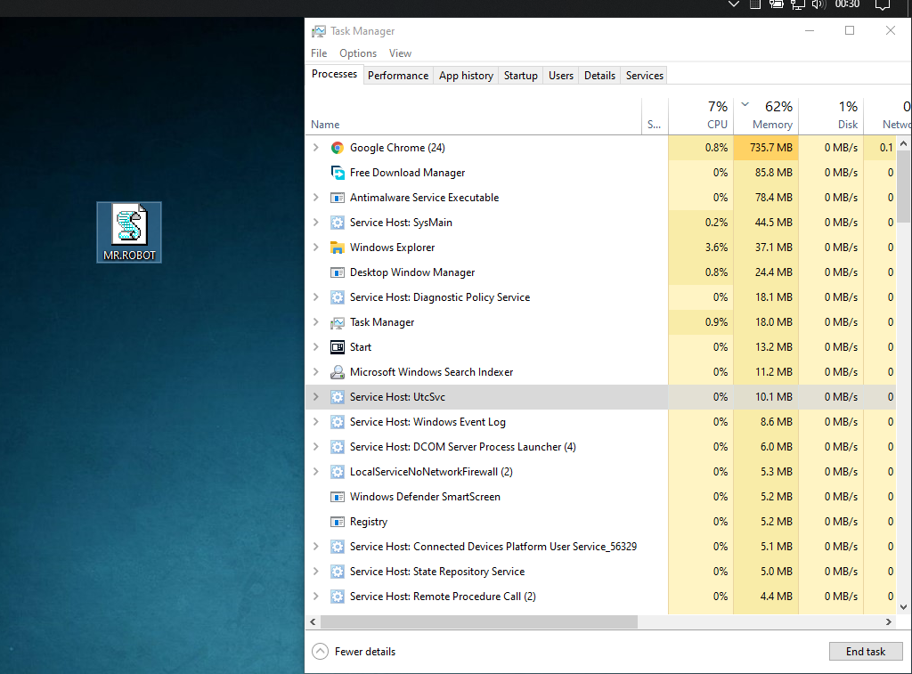
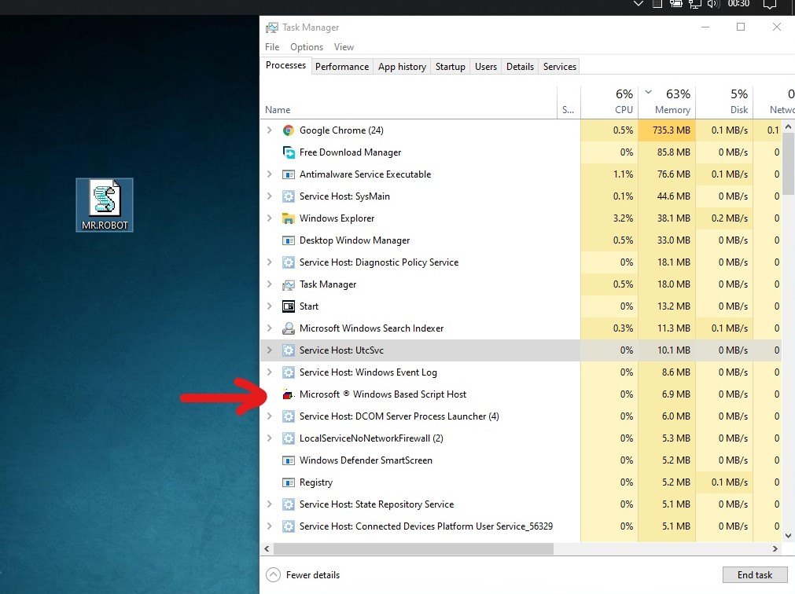
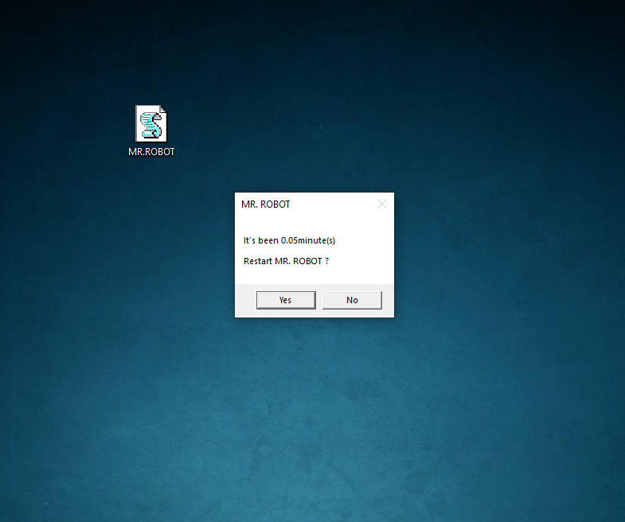

# Mr.Robot

Mr.Robot is a [VBScript](https://www.tutorialspoint.com/batch_script/index.htm) program that gives you reminder after a certain time.

## Demo

 



## Operating platform
> Windows Only

## Installation

### Windows:
:arrow_down:[Download](https://github.com/Reymor/Mr.Robot/releases/) the .vbs file and double click on it to run.

### For Developers

Clone the source locally:

```sh
$ git clone https://github.com/Reymor/Mr.Robot
$ cd Mr.Robot
```
## Features

- [x] Fast startup
- [x] Voice message
- [x] Offline support
- [x] No singup/login required
- [x] Auto launch on Startup
- [ ] Auto updates

## Usage

- Double Click on the .vbs file and it will start in the background.
- When the message box is shown -
 - Click <kbd>Yes</kbd> to reset the timer.
 - Click <kbd>No</kbd> to quit.

## Build with

- [Microsoft VBScript (Visual Basic Script)](https://www.tutorialspoint.com/batch_script/index.htm)


## Bonus

- Export the .vbs file to - 
> C:\Users\[User Name]\AppData\Roaming\Microsoft\Windows\Start Menu\Programs\Startup
- This will automate the program to run on Windows Startup.
- Visit [this site](https://helpdeskgeek.com/windows-10/how-to-access-the-windows-10-startup-folder/) to know more.
